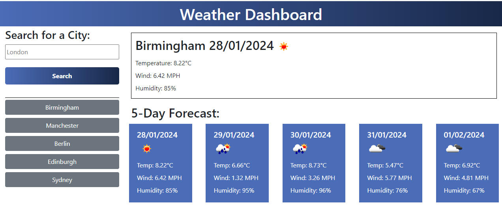
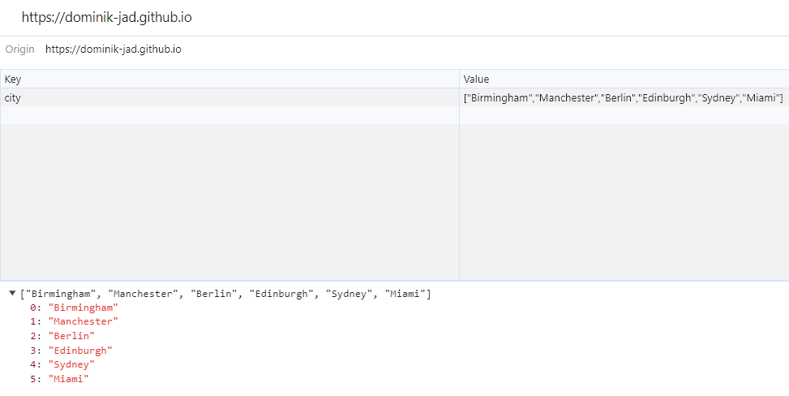
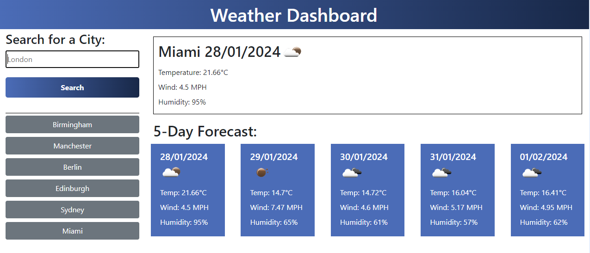

# Weather Dashboard


<details>
  <summary>Table of Contents</summary>
  <ol>
    <li><a href="#Description">Description</a></li>
    <li><a href="#Screenshot">Screenshot</a></li>
    <li><a href="#Installation">Installation</a></li>
    <li><a href="#Usage">Usage</a></li>
    <li><a href="#Link">Link</a></li>
    <li><a href="#Credits">Credits</a></li>
    <li><a href="#License">License</a></li>
  </ol>
</details>


## Description
The main purpose of this weather dashboard is to take a user-specified city or one from the history and provide the users with up to date information about the current weather conditions and future weather conditions for their specified location.  The dashboard uses simple icons to help the user understand the weather conditions. The search history is saved in the local storage of the user so that they can simply click on a city they previously searched for and have weather information displayed.


## Screenshot







## Installation


To install this project clone the repo
    ```
    git@github.com:Dominik-Jad/weather-dashboard.git
    ```


Open the files in VS Code and select 'Open With Live Server' on index.html. The live website should open up and there you can type in your city and have the weather forecast displayed.





## Usage

This simple website is very easy to use. Once opened the user can simply type in a city name and have the current and future weather conditions displayed for them. There is no limit to how many cities they search for. To help with the user experience the search history is saved. This means the user can use the button with a previously searched city to display weather information for that city.


## Link


https://dominik-jad.github.io/weather-dashboard/


## Credits


API Keys - https://coding-boot-camp.github.io/full-stack/apis/how-to-use-api-keys

OpenWeather 5 day forecast - https://openweathermap.org/forecast5

Reset CSS (Public Domain) - https://meyerweb.com/eric/tools/css/reset/

## Licence


Please refer to the LICENCE in the repo.


